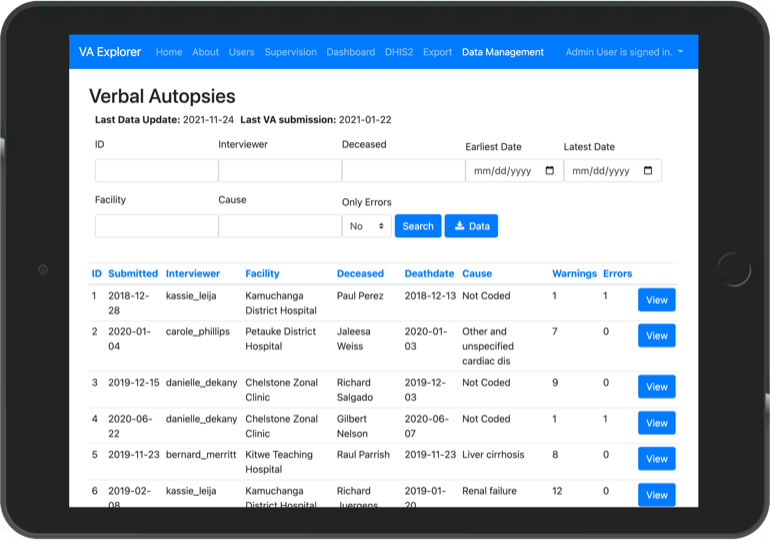
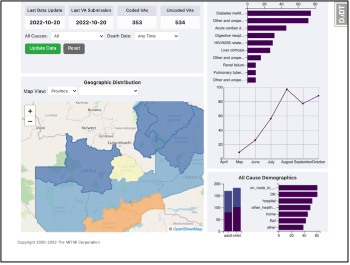

#  VA Explorer

[](https://github.com/VA-Explorer/va_explorer/blob/main/docker-compose.yml)
[](https://github.com/VA-Explorer/va_explorer/actions?query=branch%3Amain)

VA Explorer is a full service verbal autopsy (VA) management reference implementation.
It demos VA data management and analysis capabilities while exploring IT challenges
in the VA domain. This reference implementation represents a work-in-progress,
maturing in response to feedback from users and subject matter experts like in our
Zambia pilot program. VA Explorer currently supports the following features:

- User account management and role-based access
- Supervision of users' and facilities' incoming data
- Automatic cause of death assignment via algorithms like InterVA5
- Visualization and analysis dashboard with geography, demographics, trends, etc.
- Ability to detect and correct errors in collected VAs
- Import of VA data and export of processed VA data
- Integrations other tools in the domain such as ODK Central and DHIS2

for more details, see [VA Explorer's Features](https://va-explorer.github.io/va_explorer/usage/features.html)

<p align="center">
  
  </br>
  
</p>

## Background

VAs are [a standardized WHO instrument](https://www.who.int/standards/classifications/other-classifications/verbal-autopsy-standards-ascertaining-and-attributing-causes-of-death-tool)
in the form of a structured interview for determining the most likely cause of
death based on interview answers. VA Explorer aims to help users of VAs (typically
those involved in civil registration and vital statistics) process, manage, and
analyze their collected data by integrating other VA IT tools and functionalities
behind a single, scalable, shared interface.

## Deploy Your Own

VA Explorer instances are easily deployed via docker-compose and web server.
[Read the guide](https://va-explorer.github.io/va_explorer/usage/getting_started/)
to learn how to run VA Explorer for yourself or your organization.

## Getting Started

Full documentation and training on how to install, configure, deploy and use VA
Explorer is available at [va-explorer.github.io/va_explorer](https://va-explorer.github.io/va_explorer)

The rest of this README focuses on a quick start for _**contributors**_. If that
applies, thank you. Your contributions are welcome and hugely appreciated. Read
on to get started.

### Pre-requisites

VA Explorer is built with Django, backed by Postgres, and packaged with Docker so
contributors should, at a minimum, install:

- [Python 3](https://www.python.org/downloads/)
- [Postgres](http://www.postgresql.org/)
- [Docker](https://www.docker.com/)

### Setup

## 1. Clone this repo and change into the new directory

```shell
git clone https://gitlab.znphi.co.zm/srsgroup/srs-vae-new 
```
Next, cd into your created project
```shell
 cd srs-vae-new
```

## 2. Create a project virtual env and activate it


  ### NOTE: If you have a Python version higher than `3.12` installed eg. `3.13` onwards, you may need to specify the lower version for easy compatibility with the project. For example, you can use `Python 3.10`. You can do this by running the following command:

```shell
py -3.10 -m venv vae_venv 
```

This command above will create a virtual environment named `vae_venv` using `Python 3.10`. Specify the Python version you want to use in place of `3.10` above.

Otherwise , you can use the following command:

```shell
python -m venv vae_venv
```
This will use your default Python version. Just make sure it is between `3.10.xx` and `3.12.xx` to avoid any compatibility issues within your virtual environment.

Next, activate your virtual environment by running the following command:

### For Command Prompt Terminal:
```shell
vae_venv\Scripts\activate
```

### For PowerShell Terminal:
```shell
.\vae_venv\Scripts\Activate
```

### For Git Bash Terminal:
```shell
source vae_venv/Scripts/activate
```

### For Linux/Mac Terminal:
```shell
source vae_venv/bin/activate
```

## 3. Install app dependencies and local dev dependencies

```shell
pip install -r requirements/local.txt
```

## 4. Create a database and local .env config for your `vae_cms_db` database

NOTE: Before this step, you need to have a PostgreSQL installed on your machine (Recommended version is 16). If you don't have it installed, you can download it from the official PostgreSQL website (https://www.postgresql.org/). After installation, you can run the command below. If you already have PostgreSQL installed, you can skip this step and run the command below.

**Additionally, you will need to edit the `.env` file with your database credentials to be able connect to your PostgreSQL database.**
In your `.env` file, replace the following placeholders with your actual database credentials:

```shell

## Custom DB Connection Settings, only change if not using included postgres container
POSTGRES_HOST=localhost
POSTGRES_PORT=5432
POSTGRES_DB=<YOUR DATABASE NAME>
POSTGRES_USER=<YOUR DATABASE USERNAME>
POSTGRES_PASSWORD=<YOUR DATABASE PASSOWRD>

```

Next, proceed to the next step below
```shell
createdb vae_cms_db -U postgres && cp .env.template .env
```
### This command above will create a new PostgreSQL database named `vae_cms_db` and copy the `.env.template ` file to `.env` file. You can replace `vae_cms_db` with your desired database name and `postgres` with your desired database username.

## 5. Run `vae_cms_db` database migrations

### NOTE: Before running the migrations, countercheck your `.env` file to ensure that the database credentials are correct. Next run the following command:

```shell
pip uninstall psycopg2
pip install psycopg2-binary

```
***Explanation***
### This command will uninstall the `psycopg2` package and install the `psycopg2-binary` package which is a binary version of the `psycopg2` package. This is necessary because the `psycopg2-binary` package is required for the `vae_cms_db` migrations to run correctly.


The universal approach that works in all terminals:

`bash`
```shell
python manage.py makemigrations
python manage.py migrate
```

Terminal-Specific Syntax
`Command Prompt (CMD)`
```shell
python manage.py makemigrations
python manage.py migrate
```

`Git Bash`
### Option 1 (Recommended)
```shell
python manage.py makemigrations
python manage.py migrate
```
### Option 2
```shell
./manage.py makemigrations
./manage.py migrate
```

`PowerShell`
### Option 1 (Recommended)
```shell
python manage.py makemigrations
python manage.py migrate
```
### Option 2
```shell
.\manage.py makemigrations
.\manage.py migrate
```

`Linux/Mac Terminal`
### Option 1 (Recommended)
```shell
python manage.py makemigrations
python manage.py migrate
```

### Option 2
```shell
./manage.py makemigrations
./manage.py migrate
```


## 6. Initialize user permissions and create an admin to login with

**Universal approach that works in all terminals:**
```shell
python manage.py initialize_groups 
python manage.py seed_admin_user <EMAIL_ADDRESS> --password <PASSWORD>
```

**Example:**
```shell
python manage.py initialize_groups 
python manage.py seed_admin_user admin@example.com --password 12345
```
**Explanation:** 
- `initialize_groups` command creates the default groups and permissions.
- `seed_admin_user` command creates an admin user with the specified email and password.
- Replace ` admin@example.com` and `12345` with your desired email and password.

**Terminal-Specific Syntax**

**Command Prompt (CMD)**
```shell
python manage.py initialize_groups
python manage.py seed_admin_user <EMAIL_ADDRESS> --password <PASSWORD>
```

**Git Bash**
```shell
# Option 1 (Recommended)
python manage.py initialize_groups 
python manage.py seed_admin_user <EMAIL_ADDRESS> --password <PASSWORD>

# Option 2
./manage.py initialize_groups 
./manage.py seed_admin_user <EMAIL_ADDRESS> --password <PASSWORD>
```

**PowerShell**
```shell
# Option 1 (Recommended)
python manage.py initialize_groups 
python manage.py seed_admin_user <EMAIL_ADDRESS> --password <PASSWORD>

# Option 2
.\manage.py initialize_groups 
.\manage.py seed_admin_user <EMAIL_ADDRESS> --password <PASSWORD>
```

**Linux/Mac Terminal**
```shell
# Option 1 (Recommended)
python manage.py initialize_groups 
python manage.py seed_admin_user <EMAIL_ADDRESS> --password <PASSWORD>

# Option 2
./manage.py initialize_groups 
./manage.py seed_admin_user <EMAIL_ADDRESS> --password <PASSWORD>
```

**Example:**
```shell
python manage.py initialize_groups 
python manage.py seed_admin_user admin@example.com --password 12345
```

### This maintains the same format and structure as your existing README content while providing the terminal-specific alternatives for the admin setup commands.

```shell
./manage.py initialize_groups 
./manage.py seed_admin_user <EMAIL_ADDRESS> --password <PASSWORD>
```

Next, depending on the area of VA Explorer being contributed to, there are a variety
of management commands available to import data, seed demo users, load locations,
and more. See:

- [Admin Commands](https://va-explorer.github.io/va_explorer/training/admin_guides.html#management-commands)
- [Development Commands](https://va-explorer.github.io/va_explorer/development.html#development-commands)

## Running & Testing

After setup, contributors should be able to run VA Explorer locally:
### Option 1(Recommended)
```shell
python manage.py runserver
```
or
### Option 2
```shell
./manage.py runserver
```

and access the interface by navigating to `localhost:8000` in their browsers.
Similarly, contributors should be able to lint (via pre-commit/ ruff) and test
(via pytest) contributions like so:

```shell
pre-commit install && pre-commit run --all-files
```

```shell
pytest
```

Coverage reporting is also available via:

```shell
coverage run -m pytest && coverage report
```

configuration for these tools is provided by `pyproject.toml`

Contributors using the automatic cause of death assignment feature can do so by
building the required docker services and running that management command:

```shell
docker-compose up --build && ./manage.py run_coding_algorithms
```

further documentation on development, including troubleshooting of common issues
is available on the [documentation website](https://va-explorer.github.io/va_explorer)
and good first issues are actively tagged by current contributors
[here](https://github.com/VA-Explorer/va_explorer/issues?q=is%3Aopen+is%3Aissue+label%3A%22good+first+issue%22)

Thanks again, whether through usage, feature requests, bug reports, or pull requests,
your involvement with VA Explorer is deeply appreciated!

## Security & Privacy

VA Explorer uses open-source third-party libraries from well-known and/or reputable sources. The MITRE
Corporation does not vet the security of those software libraries. If security concerns you, you or
your organization may want to review the third-party libraries and their source code on GitHub.

## Attribution

This project relies on contributions from the community, in addition to other existing VA open-source
libraries, without which VA Explorer would not be possible. Portions of this code, therefore, are
copyright the respective developers, which include, but may not be limited to, teams from the CDC
Foundation (e.g., DHIS-2 export) and The Ohio State University (e.g., InterVA5, pyCrossVA, openVA pipeline).

## Copyright & License

Copyright © 2020-2025, The MITRE Corporation. Licensed under Apache 2.0

The source of this information is the Data for Health Initiative, a joint
project of the CDC Foundation and Bloomberg Philanthropies.

Available publicly via [Apache License, Version 2.0](https://opensource.org/licenses/Apache-2.0).
VA Explorer also includes external software that is available under a variety of
licenses. See [LICENSE](./LICENSE) for full license text(s).

Unless required by applicable law or agreed to in writing, software distributed
under the License is distributed on an "AS IS" BASIS, WITHOUT WARRANTIES OR
CONDITIONS OF ANY KIND, either express or implied. See the License for the
specific language governing permissions and limitations under the License.

## Contact

Contact `verbal-autopsy@mitre.org` with any questions or comments.
